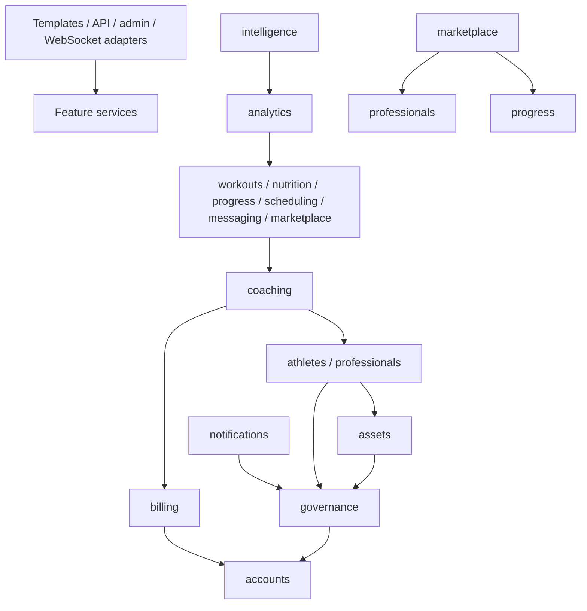

# FitLink V1 architecture

Stage 1 design amended by locked Stage 2 policies, 2026-10-03. Read with [product specification](../product/V1_PRODUCT_SPEC.md), [domain model](DOMAIN_MODEL.md), [permissions](PERMISSIONS_MATRIX.md), five ADRs and [remaining risks](../product/OPEN_QUESTIONS_AND_RISKS.md). Stage 2 creates documentation/plans only; no application, migrations, dependency installation or UI implementation.

## 1. Runtime and deployment boundary

One modular Django monolith: Python 3.13, Django 5.2 LTS, Django REST Framework, PostgreSQL, Redis, Celery/Beat, Django Channels/channels_redis and S3-compatible storage. Django Templates, HTML, Tailwind CSS and Vanilla JavaScript ES Modules render a Persian RTL responsive PWA. No SPA framework, microservices or additional search infrastructure.

The same release artifact runs ASGI web/Channels, Celery workers and a single Beat scheduler. These are process roles, not separate services with independent domain ownership. A TLS reverse proxy fronts web; PostgreSQL, Redis and storage control APIs are network-private. PostgreSQL is authoritative for all business state. Redis logical databases/namespaces separate cache, rate limits, broker/result data and Channels; worker queues can separate notifications, files/exports and AI for operational isolation without a new system architecture. No domain depends on a cache being durable.

Local development later may use MinIO, mock SMS, deterministic AI stub and fake payment adapter. Production uses configurable Iranian gateway/SMS adapters and actual private storage. Exact compatible dependency releases and pose runtime require verification in the next authorized stage; the locked versions are not changed here. Do not send real client records to development stubs/logs. Select Redis as Celery broker and short-lived result backend (assumption 24-hour result TTL), ignoring results for fire-and-forget delivery tasks; durable AI/report/payment job state lives in PostgreSQL.

## 2. Cohesive Django apps

Use sixteen recommended apps. Submodules below are ordinary modules, not automatically more Django apps. This refines the user's twenty candidate areas by grouping CRM with relationships, check-ins with progress, AI Mirror with intelligence and moderation/audit/privacy in governance, while adding a concrete private asset owner.

| App | Owns | Does not own |
|---|---|---|
| accounts | Custom User, phone OTP, session controls, adult eligibility, account state, invite/referral tokens | domain roles or client grants |
| governance | consents, audit, reports/disputes/moderation, privacy requests, important feature flags | professional plan logic |
| assets | asset metadata, private/public segregation, upload quarantine, derivatives, download grants | business decision to share/publish |
| billing | Pro plans/prices, orders/payments/subscriptions/entitlements, gateway adapter | coaching payments |
| athletes | private profile/baseline/health declarations | public marketplace profiles |
| professionals | capabilities, setup/profile/branding, credentials/verification, locations, assistant memberships, public posts | relationship activation |
| coaching | packages, intake, requests, capacity/waitlist, relationship episodes/scopes, client tags/groups, private notes, CRM and recorded revenue | workout/nutrition structure |
| workouts | libraries/templates, programs/revisions/assignments, execution overrides, sessions/sets and offline sync | nutrition prescribing |
| nutrition | food/recipe library, meals/plans/revisions, actual intake/adherence, confirmed image suggestions | general AI provider integration |
| progress | daily/body metrics, goals/milestones/photos, recurring check-in forms/occurrences/submissions | public case-study publication |
| scheduling | availability, consultations/appointments, reservations, cancellations/history | payment settlement or calling |
| messaging | direct conversations/messages/contextual replies, broadcasts/deliveries | group ownership or push transport |
| marketplace | public search/profile aggregation, favorites/comparison, reviews/revisions/responses, consented case studies | private professional workspace |
| analytics | filtered timeline/report projections, exports, professional/product metrics | authoritative activity writes |
| intelligence | AI adapters, insights/suggestions, food-image drafts and Mirror summaries | publishing plans or owning activity records |
| notifications | in-app notifications, push subscriptions, delivery preferences/attempts | message persistence or OTP delivery |

Intelligence and notifications stay separate because generation and delivery have different policy and failure lifecycles. A minimal `config` project package contains settings/URLs/ASGI and explicit composition wiring, not domain logic.

Each app uses focused models, selectors, services, policies, forms/serializers, tasks and presentation modules as needed. A simple operation need not have artificial service classes. Complex workflows and state transitions belong in domain services; views/forms/serializers call them. Templates/JavaScript never enforce authoritative rules. Avoid god models, giant utils modules and generic form/ACL/workflow frameworks.

## 3. Dependency direction and coupling rules

An arrow here means **consumer depends on provider**. Foundation layers cannot import feature layers. Minimal shared values (UUIDs, dates, typed errors, event envelope) may be plain Python modules without domain ownership.

The diagram compresses groups; the following allowed dependencies are authoritative:

- accounts has no feature-domain dependencies. Account deletion orchestration lives in a composition root, outside accounts.
- governance → accounts only. Subject references are typed object UUIDs, not imports/FKs back to every feature. Feature services validate referenced subjects before creating reports/consents/audits. Moderation/erasure orchestration is a composition-root workflow that invokes explicit domain handlers.
- assets → accounts/governance. Domain policies issue authorized access requests; assets cannot infer access from a generic relationship ID supplied by a caller. Link asset ownership to User and purpose, with a validated domain subject reference.
- billing → accounts/governance; athletes → accounts/governance/assets; professionals → accounts/governance/assets/billing for optional branding policy.
- coaching → accounts/athletes/professionals/billing/governance/assets. Professionals do not import coaching to compute public capacity; a read projection or marketplace composition obtains it.
- workouts/nutrition/progress/scheduling/messaging → coaching, relevant profiles, accounts/governance/assets. These peer activity apps do not directly mutate each other. Contextual object links are validated by presentation/composition services and stored as typed references.
- marketplace → professionals/coaching/progress/governance/assets/accounts. It reads consented progress through selectors; progress does not know case studies exist.
- analytics → activity apps, marketplace, coaching, profiles, billing/governance/assets. It reads, not mutates, their authoritative data. Activity apps emit events and never import analytics.
- intelligence → authorized analytics selectors and activity revision readers, coaching/billing/governance/assets/accounts. Plan services never import intelligence. Approval orchestration invokes intelligence validation then workouts/nutrition publication and records the result transactionally. Nutrition image confirmation likewise validates an intelligence result then calls nutrition.
- notifications → accounts/governance only for delivery. Origin domains/composition send already sanitized descriptors plus recipient IDs and revalidation references. A composition-root handler rechecks originating permissions before delivery; notifications does not import all source apps.

Composition roots under the project package wire use-case handlers and domain-event subscribers; they hold no business rules. Avoid a general plugin registry or event framework: explicit named dispatch is sufficient. Typed subject references must have validation, cleanup and ownership rules; they are not a substitute for relational FKs within cohesive domains. Cross-app querysets cannot be imported casually to bypass selectors.

## 4. Server rendering and API boundary

Django Templates serve navigation, marketplace/public profiles, wizards, dashboards and forms. ES Modules enhance interactive plan editing, chat, reports, offline workouts and Mirror. Server-rendered pages remain the primary route model; no SPA router. Domain services power both HTML form handlers and DRF `/api/v1/` endpoints.

APIs expose public UUID resources, explicit commands (`accept`, `publish`, `end`, `approve`) and scoped selectors; not unrestricted CRUD over every model. Use pagination and bounded filters; document schemas, enums, units, timestamps and machine-readable errors. API versioning is independent of plan/form revisions. Changes within v1 must preserve compatible contracts; incompatible changes require a new version. Future native apps can reuse domain/API contracts; native authentication is explicitly deferred, not forced to reuse browser cookies.

Browser requests use Django session cookies and CSRF, including OTP actions and sync writes. Login rotates the session; cookies are Secure/HttpOnly for session, suitable SameSite, and production TLS. No browser JWT/localStorage token substitute. Object authorization applies to list queries, detail reads, writes, counts, attachments and generated outputs. Public projections allowlist fields and never serialize full profile/credential/athlete models.

Response conventions: 401 authentication required where applicable; 403 forbidden; 404 for objects outside visible scope to limit enumeration; 409 state/revision/capacity conflicts; 422 or consistently documented 400 validation failures; 429 throttled with retry metadata. Choose DRF-compatible 400 for validation as the assumption. Access checks precede detailed conflict responses for inaccessible objects. Client hints are not authority.

## 5. Synchronous workflow boundaries and consistency

Request/response performs OTP verification, relationship acceptance/ending, reservations, consent changes, log sync, plan publishing/AI approval, review eligibility checks, entitlement checks and verified payment transitions. Use database transactions and uniqueness/check constraints where possible, not asynchronous eventual acceptance.

Acceptance locks professional capacity/entitlement anchor, athlete scope anchor and package in stable order, rechecks counts/scopes and writes request/relationship/seat/outbox atomically. Multiple packages/roles cannot evade distinct-client limits. Unique active athlete/scope allocation prevents conflict; use rows, not JSON scope lists. Training and nutrition are explicit; structured nutrition requires Nutritionist authorization. Optional contest scope needs nonoverlap definition before activation. All admission paths use this service and central entitlements.

Appointments use canonical UTC intervals and prevent overlap for the professional and athlete, including consultation reservations. Capacity reduction below occupancy permits existing seats, disallows new seats and displays over-capacity rather than deleting relationships. Price/intake/policy changes affect future requests; acceptance presents changed terms for reconfirmation if the original package snapshot is no longer honored. Duration renewal is an explicit agreement, not inferred from external payment.

Plan publication locks/checks expected base revision; a transaction writes immutable new revision, assignment change, AI approval evidence if any, audit and notification event. Nutrition uses the same semantics in its own domain; no premature generic plan engine. Rollback creates a new revision. Athlete scheduling/substitution overrides never mutate these snapshots.

Ending/ArchiveManifest orchestration lives at the composition root: gather delivered/finalized source references through installed activity selectors, validate author/episode/cutoff, then invoke coaching's end transaction with server-produced candidates. Coaching never imports downstream workouts/analytics to discover records; source IDs remain validated typed references. Manifest and operational cutoff are synchronous, not a job that might include post-end data. Consent withdrawal redacts archive derivatives from fixed historical inputs, never new/live reports.

## 6. PWA and offline synchronization protocol

Service Worker caches versioned static assets/app shell. IndexedDB stores minimal athlete-selected workout snapshots, local WorkoutSession/SetLog records and an account-scoped outbox. Do not cache health documents, photos, messages, reports or general private API responses in Cache Storage. Offline content is accessible to someone with access to that browser; disclose this and support clear-local-data. Do not pretend IndexedDB is protected from same-origin script compromise.

Each operation has client-generated UUID `operation_id`, stable entity UUID, schema version, user scope, base server revision, payload hash and local sequence. Server derives athlete ownership from session, never from client payload. Unique `(user, operation_id)` SyncOperation receipt retains normalized payload hash and outcome; unique session/set IDs prevent duplicate creates across operations. Inserts/updates and receipt commit atomically. A replay with same key/hash returns original outcome; different hash returns 409. Receipts/tombstones remain at least as long as the permitted offline window; interim window 30 days, receipt retention 90 days, configurable pending retention review.

Batch sync returns per-operation success/conflict/validation status. It is not all-or-nothing across unrelated sessions; dependency-ordered operations within a session are atomic where needed. Expected object version detects concurrent edits; differing actual values require user choice to retain server value or submit a reviewed correction against the latest version. Distinct new set IDs can merge if their parent/version invariants permit. Delete tombstones prevent resurrection; a late update to a deleted set conflicts. Completed-session corrections keep audit history. Plan revisions are never silently remapped to the newest plan.

Foreground opening, online events and manual sync always work. Background Sync is an optional capability, not the only sync mechanism, because browser support is limited ([MDN](https://developer.mozilla.org/en-US/docs/Web/API/Background_Synchronization_API)). Network/server errors use bounded retry with jitter; 401 pauses for OTP/session renewal; 403/409/400 require reconciliation; CSRF tokens are refreshed, not embedded in durable queued payloads. Pending writes show clear status. Logout warns about unsynced records and clears local account data when completed; switching accounts requires clearing old data. Expired offline windows require athlete-guided reconciliation, not silent loss. Ended relationships still permit owner log sync while blocking professional visibility.

## 7. Real-time and asynchronous boundaries

Channels with channels_redis handles chat/notification event delivery over session-authenticated WebSockets. Enforce allowed origins/hosts; WebSocket cookie sessions require an origin boundary ([Channels security documentation](https://channels.readthedocs.io/en/stable/topics/security.html)). On connect/subscription and every incoming action, check user/account state and conversation/relationship membership. Never accept arbitrary client group names or User IDs. Recheck permission before sensitive outbound events; publish only IDs/sanitized notices and let HTTP selectors retrieve authorized content. Revocation closes connections/removes memberships, with rechecks protecting races. Rate/size limits apply to socket messages. Files upload through the asset workflow, never base64 socket bodies.

HTTP is the canonical message-write path in V1, with idempotent client message UUIDs. WebSockets carry new-message/unread notifications; reconnect uses a durable cursor/HTTP backfill. Redis events are ephemeral and cannot establish message delivery history. In-app Notification rows and Message rows in PostgreSQL are authoritative.

Celery jobs perform notification/push delivery, report exports, AI, asset scans/derivatives, recurrence materialization, reminders, waiting-list notices, business projection updates and privacy exports/deletion orchestration. Beat triggers due-row scans and idempotent recurring occurrence creation; only one scheduler instance. Time-sensitive permissions/entitlements are evaluated from current state, not a stale task.

Transactional outbox rows record committed events. `on_commit` may prompt dispatch but is not the sole durability mechanism; an outbox scanner repairs broker outages. Workers claim rows, retry with bounded exponential backoff/jitter, record attempts/failure and expose operator retry after exhaustion. Treat delivery as at-least-once: unique job effect keys and provider reference reconciliation prevent duplicate side effects. Celery guidance supports idempotent task design and explicit retries ([task documentation](https://docs.celeryq.dev/en/stable/userguide/tasks.html)). Jobs carry object IDs and purpose, not sensitive files/prompts. Reauthorize at execution and final artifact release; cancelled/revoked jobs abort and purge stale outputs. A timeout never authorizes optimistic success.

## 8. Assets, privacy and data lifecycle

All uploads first create private Asset records: owner, purpose, verified subject, opaque key, checksum, detected MIME, size, scan status and classification. Issue narrowly scoped upload authorization, then finalize by verifying actual object size/checksum/type; client-supplied metadata is untrusted. Quarantine pending validation/malware scanning. Defaults: images ≤10 MB, documents ≤20 MB, custom exercise videos ≤100 MB; reject active HTML/SVG/script uploads, enforce extension/type allowlists, transcode/re-encode image previews and strip EXIF. Values are engineering assumptions, configurable without granting public access. Credentials, photos, health, chat attachments, dispute evidence and reports stay private.

Public images/media are separate sanitized copies created only after source-domain publication authorization and consent checks. Store them in a separate public namespace/bucket. Public profile source uploads and identity documents are never made public by toggling one bucket-wide setting. Serve untrusted downloads from an isolated origin with content-disposition/type controls, consistent with [Django upload/security guidance](https://docs.djangoproject.com/en/5.2/topics/security/).

For private download, recheck object policy and log sensitive access, then stream through an authenticated endpoint or issue a short-lived signed URL (assumption maximum 60 seconds). Never expose permanent keys. A previously issued URL may remain usable until expiry: immediate high-risk revocation uses authenticated proxy delivery rather than claiming instant signed-link invalidation. Send private responses with no-store; CDN must not cache private responses. Consent withdrawal invalidates reports/timeline/AI/publication references and future links. Derivatives inherit classification. Export workers must not create public PDFs/CSVs.

Consent binds subject/owner/grantee/purpose, object/category scope, version/dates/expiry. Purposes distinguish storing health, active sharing, narrow archive sharing, Coach nutrition-adherence reads, reviewed AI processing, Mirror summaries and case-study publication. Operational sensitive sharing requires active relationship plus grant; ended-service archive uses fixed manifest and independent current archive grant instead. Assistants inherit neither sensitive nor archive grants. Sharing an athlete grants no access to another professional's notes/history/plans.

Disconnect immediately closes operational access, revokes active grants/channels/jobs and excludes all new athlete data. At end, coaching records an immutable ArchiveManifest of professional-authored delivered plan revisions, finalized report/summary IDs, professional notes and completed appointments, with cutoff and provenance. Archive selectors permit read-only service history to that professional only, filtering/redacting athlete-derived material by current purpose-specific archive consent and retention status. No live-profile/timeline query, new report generation or future-data feed. Files retain per-object checks; finalized status is not a consent bypass. Historical chat is not automatically in the ordinary archive. Held evidence is separately accessible only to authorized staff. Assistants receive no archive access. Restart creates a fresh episode.

Deletion uses PrivacyRequest states requested → verified → pending_deletion → evaluating_holds → deleting/anonymizing → completed (or partially_held, then resumes after release). Restrict normal account access at verified request, invalidate auth/public/sharing access and inventory DB/storage/derivatives/projections/exports/provider artifacts. RetentionPolicy stores centrally configurable versioned durations per data class/purpose, infrastructure backup policy reference and approval metadata; policies are not scattered constants. RecordHold binds specific records to dispute, fraud/security or required audit purpose, authorizer, reason, review/expiry and release. It blocks only affected erasure and grants no normal professional access. Evaluate holds before each erase; audit completion and retained exceptions. Actual durations/legal basis require operational sign-off before live release.

Backups are restricted snapshots with centrally configured retention/inventory/expiry. ErasureMarker records survive longer than every backup eligible for restore. Deleted content ages out when the last containing backup expires and is destroyed; no claim of selective erasure from immutable backups. Restore offline, reapply deletions/revocations/account restrictions, verify, then resume traffic. External AI retention and downloaded public copies require disclosure. No jurisdictional compliance certification is asserted.

## 9. Provider contracts and billing

SMS adapter: send OTP with normalized phone, correlation/idempotency identifier and delivery result; mock implementation must be blocked by production configuration. Secrets/code are redacted. Gateway adapter: initiate order, verify authority/reference server-side, query pending status and normalize provider errors. AI adapter: typed requests/results, capability, timeout, provider/model metadata, schema validation and redaction policy. Storage adapter uses Django storage/S3-compatible operations for private put/get/delete/sign; domain policy stays outside the adapter. Vendor names are configuration, not embedded in domain models.

Billing stores money as integer Iranian rial (IRR); display toman, if selected, explicitly divides by ten and labels it. Gateway currency conversion occurs only in the adapter and is verified. Pricing revisions snapshot monthly/annual amount, stated annual discount, effective date and entitlements. No coaching-package order becomes a billing Payment. RevenueRecord remains unverified manual coaching data.

Payment: created → pending → verified/failed/cancelled; indeterminate is pending_reconciliation, not success. Callback is untrusted: check bound order, merchant, amount/currency and gateway authority; verify server-to-server; lock Payment and create unique activation effect. Duplicate callbacks return previous result. Callback paths are narrowly handled separately from browser CSRF only as required by gateway protocol; browser mutations keep CSRF. Paid order status comes from verification, not return URL. An outage can be reconciled by a scheduled status query. No payment-card secrets are stored.

Subscription uses UTC start/end/grace_end and immutable paid period records. Central `billing.entitlements.resolve(professional, at)` returns effective tier, active-client limit, feature set and configuration version. Free limit is five; beta Pro default is 100, Admin-editable without deployment. All domain callers use this service; no scattered business constants. Config changes apply to current admission checks; purchased price/period snapshots remain historical. Cache-version invalidation and in-transaction fresh checks prevent stale-limit admission. Missing/invalid Pro config fails closed; lowering a limit keeps existing clients but blocks additions when at/over limit.

Entitlements derive active/grace/Free from current timestamps, with seven-day grace, regardless of Beat delay. Assumption: renewal extends from the later of prior paid end and verification time. Core data stays accessible under ordinary permissions after downgrade; Pro-only actions are blocked, not records deleted. Advanced branding falls back to baseline; jobs recheck entitlements. SMS/payment/AI production vendors remain unselected in Stage 2; later integration stages select adapters, while development/test use fakes.

## 10. Audit, history and transactional events

Governance owns append-only AuditEvent and OutboxEvent. Important writes append audit in the same transaction: OTP security outcomes (without codes), account restrictions, verification, acceptance/end/restart, consent, assistant membership, plan revisions/AI approval, payment activation, moderation, admin configuration and export/deletion actions. Sensitive reads/file grants, admin evidence access and AI data release generate metadata-only events. Fields: actor/system/job identity, action, timestamp, correlation ID, typed subject UUID, workspace/relationship, reason, redacted changed-field names and result. Do not copy full medical declarations, OTPs, messages or prompts into audit.

Operational database principals cannot update/delete audit through ordinary product services; controlled retention is a separate privileged audited process. Admin is not a universal unaudited reader. Use separate operational and sensitive-data staff capabilities with MFA/step-up and case reason for exceptional access; staff MFA mechanism remains a launch-security review, without adding required consumer password login.

Immutable ProgramRevision/NutritionPlanRevision trees contain complete snapshots (normalized child records within the domain plus schema version), parent, actor/time, change diff, AI reference and content hash. Templates/forms/food recipes/package terms have revision snapshots where historical meaning depends on them. Logs refer to published versions. ReviewRevision and moderation histories retain changes/deletion markers under approved retention. Schema upgrades must preserve old snapshot readability. API v1, data snapshot version and provider model version are distinct.

## 11. Security boundary

Canonical phone normalization uses Iranian mobile numbers in E.164; Persian/Arabic numerals normalize before validation. Unique phone ownership and OTP challenges are enforced server-side. Assumed OTP policy: cryptographically generated six digits, five-minute expiry, 60-second resend cooldown, five verify attempts per challenge, five sends/phone/hour, twenty sends/IP/hour, ten failed verifications/phone/hour and sixty failed verifications/IP/hour. Store keyed digests, not plain codes; constant-time comparison, single-use atomic consume, invalidate prior challenges on resend. Rate limits are configurable and fail closed on limiter outage; record trusted proxy-derived IP, not arbitrary forwarding headers. Do not show OTP in production logs/URLs. SMS failure does not mint a session. Return uniform responses and apply limits to both request/verify routes.

Input validation includes units/ranges, bounded JSON/form fields, pagination and safe external payment links. Autoescape templates, quote attributes, sanitize allowed educational text/branding and use CSP to constrain scripts/media; user accent color is a validated color token, never arbitrary CSS. Keep CSRF on session-authenticated API and OTP actions. Use TLS, allowed hosts/origins, secure cookies, restrictive CORS (same origin in V1), no-store private data and deployment security checks. Django does not supply OTP throttling automatically, so explicit implementation is required ([Django security](https://docs.djangoproject.com/en/5.2/topics/security/)). UUID opacity is not authorization.

Every command checks authentication, account state, profile/capability, workspace/object ownership, active relationship/scope, current sensitive consent, fixed assistant role, entitlements and flag when relevant. Check both source and destination for reassignment/upload references. Recheck before side effects and use transactional version conditions against permission races. Export, AI and report projections use the same selectors. Enumeration-resistant errors and log redaction cover all transport paths. Permission denials are observable without leaking values.

### Manual recovery boundary

Lost-phone recovery uses explicit RecoveryRequest, restricted identity/account verification evidence, authorized Admin decision, new-number OTP verification, transactional phone uniqueness/change history and auth-version/session/push invalidation. Rejected cases reveal no account information. No security questions or unaudited bypass. Evidence standards/staff MFA remain operational release gates, not permission for automated fallback.

## 12. Intelligence and Mirror boundary

AI jobs are entitlement/consent gated, use minimized authorized inputs, schema-validated output and bounded cost/time. Provider/model, input period/source IDs, uncertainty/missingness and result status are recorded privately. User text is untrusted data, not instructions to execute tools or bypass rules. Domain commands cannot be called directly by an AI provider. Failed/malformed suggestions remain failed drafts. Actionable approval requires the professional's request containing suggestion ID and expected base revision; composition publishes through the same workout/nutrition service with role checks. Reject automatic retries of stale approval without new human review.

Insights are professional-workspace private; assistants do not see them by default. V1 keeps internal insights private unless a separately approved sharing path exists. Food-image results stay unconfirmed until owner action. An external-AI release allowlist excludes progress photos, health/identity documents, arbitrary private files and raw Mirror video by default. Sensitive transfer needs a specifically designed feature (such as optional food-image analysis), required explicit consent, provider/privacy review and auditable release. Prefer derived/minimized signals; without these gates, exclude inputs or disable the feature, never silently use another vendor. Consent alone cannot enable generic file transfer.

Mirror pose inference runs browser-side using an existing library candidate such as MediaPipe Pose Landmarker; selection is deferred to a compatibility/licensing/device review, not a new model-training task. Frames/keypoint streams are ephemeral. Store derived per-exercise summary and quality/confidence flags only. Metric definitions: rep count from exercise-specific phase transitions; ROM as a clearly labeled joint-angle proxy; tempo as phase durations. These are camera estimates, not clinical measurements. Provisional observation set: squat depth/visible knee-tracking consistency; curl elbow excursion/upper-body sway; press visible arm symmetry/upper-body sway. Suppress observations where camera geometry/confidence is inadequate; thresholds require validation before release. Exactly three exercise classifiers, with feature flag/unsupported-device fallback. Sharing summary requires current explicit athlete permission; no video upload endpoint is required for V1.

Mirror is explicitly Beta and FeatureFlag-protected. MirrorValidationPolicy versions per-exercise/model/device quality/visibility thresholds and permitted observations. Below threshold, affected metrics/observations become unavailable and the session returns insufficient_confidence or insufficient_visibility with a Persian explanation; never fabricated feedback. Threshold calibration is a later validation task, not a reopened product decision.

Coach-only nutrition access uses a separate adherence selector: current training relationship plus `nutrition_adherence_read` athlete grant, with adherence/completion aggregates only. No structured-plan edits, detailed intake or nutritionist-private material. Nutritionist capability and nutrition scope are required for structured authoring/AI nutrition approval. General Coach notes can discuss adherence, but cannot prescribe foods/portions/macros.

## 13. Reporting, search and observability

PostgreSQL full-text/trigram search with normalized Persian/Arabic letters/digits and curated specialty/location fields. Parameterized queries, bounded filters and deterministic ordering with stable UUID tie-breaker. Validate Persian relevance and query plans before expanding infrastructure. Search indexes use public approved projections only, refreshed on verification/moderation/publishing/capacity events with reconciliation. Query-time public eligibility checks prevent stale-index exposure. Athlete personalization uses declared goals/preferences; do not index sensitive health or invent scoring percentages.

Business definitions: active clients = distinct athletes with active episodes at observation time; new leads = created within period; conversion = accepted unique leads divided by eligible leads in stated creation cohort, not mixed periods; churn = distinct starting active clients with all relationships ended in period divided by starting active clients, with reactivation caveat shown; package utilization = occupied seats/capacity, over-capacity labeled; popularity = accepted relationship count by package; sources = first recorded lead attribution with unknown preserved. Revenue sums explicitly recorded entries in stated currency/status, labeled unverified/estimated. Reports/timeline are permission-filtered projections, never permissions sources. Retain stable source IDs and generation period/version; missing inputs remain unknown. CSV formula-like cell prefixes are escaped; PDFs embed tested Persian fonts and RTL shaping.

Structured operational logs include request/job correlation IDs, endpoint, latency, error class and retry count without private payloads. Metrics include HTTP/WS failures, OTP throttle/failure rates, queue age, task retries, outbox backlog, sync conflicts, scan failures, export latency, provider timeout/cost, payment verification backlog and consent-denied access. Alerts target sustained errors/backlogs and unusual access/payment failure. Product events use pseudonymous IDs/minimal data; no health or message content in analytics tooling. Record deployment/config changes. Restricted error monitoring must scrub headers/cookies/upload names/phone data. Operator runbooks cover provider outage, broker recovery, retry exhaustion, consent revocation, payment reconciliation and data restoration.

## 14. Assumptions, future validation and reversibility

Minor choices above remain engineering assumptions. Stage 2 closes the material publication/nutrition/archive/deletion/client-limit/AI/Mirror/recovery policies; remaining operational details are in the risk register. Authorized Foundation execution validates runtime/dependency compatibility; later provider/Mirror stages validate reachability, licensing and devices. Stage 2 installs nothing and chooses no production SMS/payment/AI vendor.

Later verification must include cross-tenant negative permission tests, concurrent capacity/scope/client-limit writes, idempotent payments/jobs/sync, revision/AI stale approvals, revoked grants across artifacts/transports and real Persian export/device checks. Restore drills must verify deletion markers; migrations should be incremental, reversible where practical and compatible with existing snapshot versions. No automatic schema/data purge accompanies deployment or subscription expiry.

### Foundation migration boundary

First coding stage includes minimal `apps.accounts.User` in `accounts/0001_initial` and sets `AUTH_USER_MODEL = 'accounts.User'` before any `makemigrations`, `migrate` or database-backed test. Empty PostgreSQL verification must show no default `auth_user` table. UUID public ID, canonical unique phone, auth flags and unusable-password default suffice; no OTP, profiles, recovery, entitlements or other business models enter Foundation. Later stages add fields/workflows through additive migrations. Never migrate default User and swap afterward. See the [Foundation plan](../superpowers/plans/2026-10-03-project-foundation.md).

### References checked for Stage 1 / Stage 2

- [Django 5.2 security](https://docs.djangoproject.com/en/5.2/topics/security/)
- [Channels WebSocket security](https://channels.readthedocs.io/en/stable/topics/security.html)
- [Celery task retries and idempotency](https://docs.celeryq.dev/en/stable/userguide/tasks.html)
- [MDN Background Sync support boundary](https://developer.mozilla.org/en-US/docs/Web/API/Background_Synchronization_API)

These sources support framework boundaries; product policies and proposed engineering defaults come from the locked brief or labeled assumptions, not the documentation.
